#Azure Usage and Billing Insights (AUBI) Portal


## System setup
###Creating required services with Powershell script:
First you have to create the required Azure services and keep the records of service access keys that will be used in the   projects' configuration files named: **App.config** and **Web.config**. For the below services we will primarily use the default creation parameters. For higher performance criterion, you can change default settings by i.e. increasing instance count of web app or scale Web app or SQL Server to a higher tier etc. 

Required Services:
- Azure SQL Database
- Azure Storage
- 2 x Azure Web Apps
- Azure Default or new Active directory (AD) (**for Microsoft FTE subscriptions, it is required to create a new AD**)

**To create the above services**, you can use the PowerShell script named “CreateAzureServicesScript.ps1” with its dependency file “CreateAzureServicesScriptResources.json”. Both files are located under project solution directory and uses Azure Resource Manager (ARM) to create these required services. **To be able to use ARM**, you need to install Azure PowerShell tool from [Azure downloads](https://azure.microsoft.com/en-us/downloads/). It is strongly advised that you browse the inline comments and change variable values in “CreateAzureServicesScript.ps1” file to customize default settings, service names etc. that will be created. You should run powershell in **“administrator”** mode to execute the script. Because the script has a dependency file, once you open the powershell console, change active directory to the one where the script is stored. Or update the dependency file path parameter inside the script. Once the script successfully executed, it will output all parameter values with their names. Open and edit all configuration (Web.config and App.config) files inside the solution with these new service settings before compiling and publishing them. In the ARM template, we used "Password.1%" as a password for SQL Server etc. Please don't forget to update with your custom password to prevent any security issue.

In case there are any errors during the execution of Powershell script (maybe because the service name that you assigned in the parameters is already used, it is not unique), you can delete the *resource group* from Azure management portal and restart the Powershell script with new parameters. Because all services except the AD are created under the same resource group, deleting it means that it will delete all services under it, which may take some time. Below is the list of services created under a sample resource group name "aui-resource-group" which is the default parameter value for the resource group name in the Powershell script.

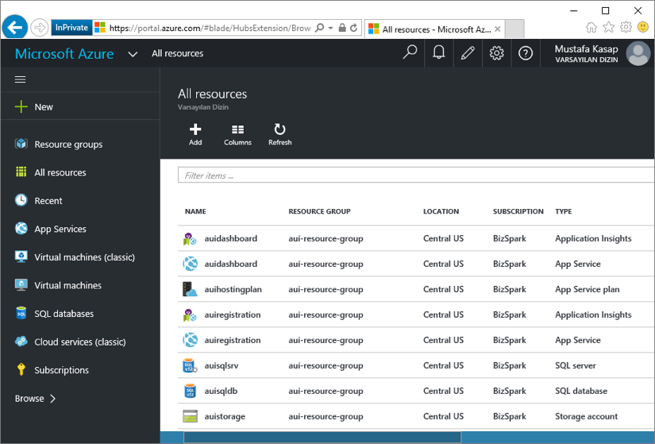  
*List of services created under “aui-resource-group” by running script “CreateAzureServicesScript.ps1”.*

Be sure that the value of "ida:QueueBillingDataRequests" parameter in webconfig files is same as the static code line in the webjob project named WebJobBillingData, function.cs file as:

```
public static void ProcessQueueMessage([QueueTrigger("billingdatarequests")] BillingRequest br)
```

Once the services are created you can open the default Active Directory service settings in the old portal (it is not supported in the new Azure portal at the time of writing this guide) to finalize its settings (these settings cannot be applied with ARM scripts yet and require manual editing). 

From Default Directory Service, open the AD app that you created.  The Name of the AD app is set in the Powershell script. You can search that name to find the AD app in the old portal.

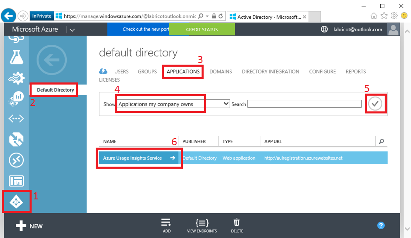  
*Steps to open AD Application's settings.*

Click on the app name, and open the application's configure page. In the configuration settings of the AD app, apply the following changes in order  

- Change “APP ID URI” value to an any valid URI in your directory.  
i.e.: http://fabrikam.onmicrosoft.com/auiv4  
	As in the above sample, your directory name (i.e. fabrikam.onmicrosoft.com) can be found under the settings page in the old portal.

  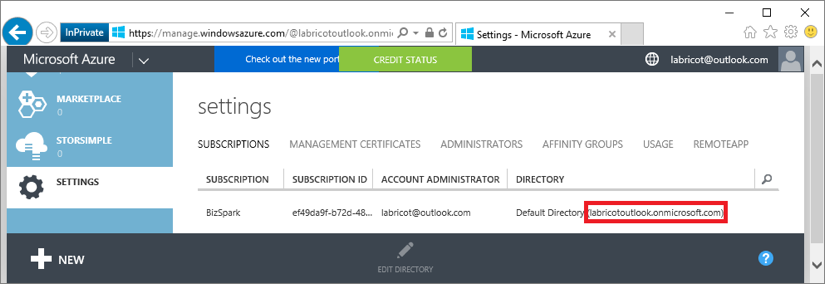  
  *Default directory name.*

- Change “Application is multi-tenant” property's value to YES

- Change “Permissions to other applications” property by adding “Windows Azure Service Management API” value to the list.
  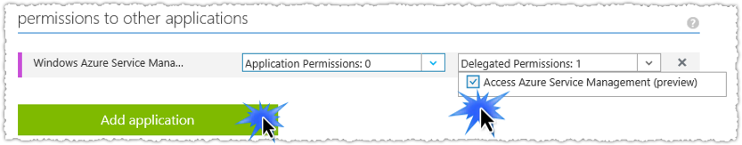  
  *Add “Windows Azure Service Management API” to the list.*

- Then change its “Delegated Permission” property to 1, as shown in the below picture.  
  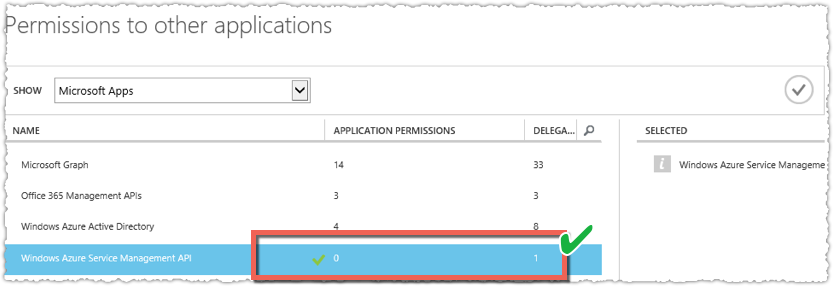  
  *Change its “Delegated Permission” value to 1.*

- Also in the same settings page, be sure that “Windows Azure Active Directory” is selected with “Sign in and read user profile” delegated permission as shown in the below picture.  
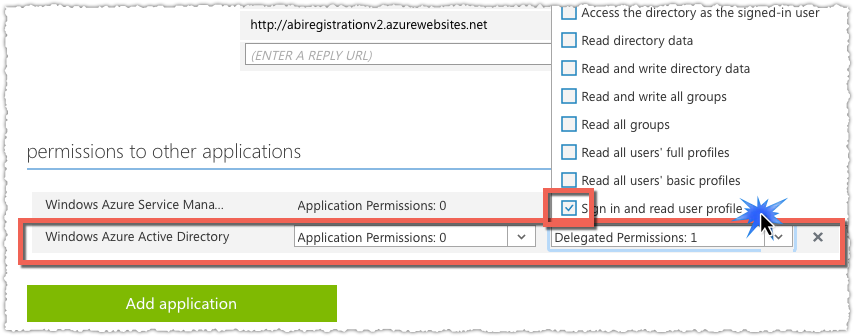  

- Details of this AD App that is created by the Powershell script and that we configured with above steps can be accessed in the Powershell output window shown below:
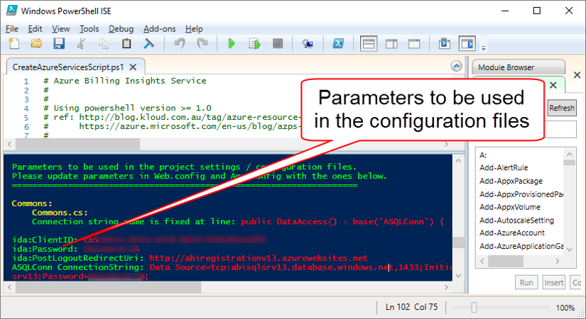  
  Here the parameters ida:ClientID and ida:Password will be used in our web application's configuration files.

Using these output values, you can update all Web.config and App.config files. After all these configuration updates, compile and publish the projects and Webjobs on Azure. We prefer to publish the two Webjobs under the Dashboard web app, not the registration web app project. **Before accessing any of these services** you need to connect to the newly created SQL server with Visual Studio, SQL Management Studio, or alternative management program and run the TSQL commands in “SQLScripts.sql” file to create a table to store billing data and its dependent StoredProcedure. Be sure that you create these two SQL objects under the **database** that you created with Powershell script (see the parameter name for the SQL Server and Database names). The name of the database is in the Powershell parameters too.

In addition to the output of the Powershell script (which is enough to run the system), you can also double check the script output by searching each service's settings from the portal with the following instructions. 

Now let's update the source code with the above parameters. Open the solution in Visual Studio, you will see the following 5 projects in the solution explorer and need to update the mentioned files in each project:

**Commons Project:**  
- Commons.cs file:  
Change the following code line in commons.cs file and replace the marked string with your SQL Connection string name (if you changed it in the parameters) that you can find in the ARM script, or in Web app settings on the portal. If you haven't made any change in the source file, then keep them as they are. Below is the screenshot of the code line in the commons.cs file.  
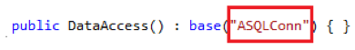  
Your connection string name is under the portal and the above parameter must be the same. Below is the screenshot from the portal where the webapp's connection string name is set as "ASQLConn":  
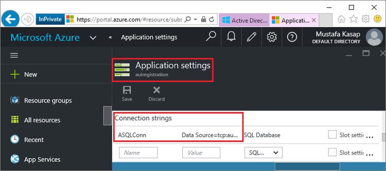  

**Registration Project:**
- Web.Config file:  
  - *ASQLConn*: Value of this variable has to be the same as the one in the WebApplication’s 
connection string that is created by the ARM script.  
    

  - *ida:ClientID*: You can get this ID value from AD Application Configuration page, the page where you make AD app settings or from the Powershell script output window.  
  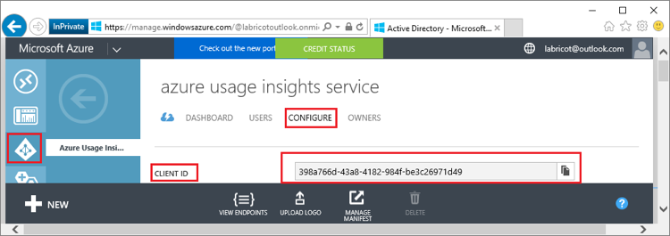  

  - *ida:Password*: This password is in the ARM Powershell script output windows.  
  
    
  - *ida:PostLogoutRedirectUri*: It has to be the same as the landing page’s URL address of the registration web app i.e. http://auiregistrationv1.azurewebsites.net.  
  
  To publish the local Registration WebApp project binaries on Azure, in Visual Studio, Solution explorer, right click on the project name and click *publish* menu item.  
  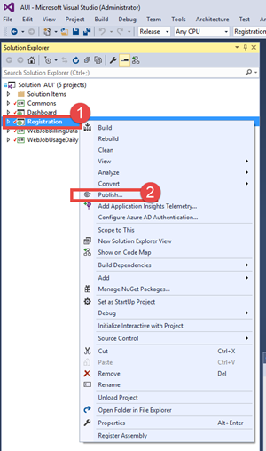

  In the publish window, Select "Microsoft Azure Web Service" and click publish. It will ask you to enter credentials to access your Azure subscription, enter username and password that you use to access azure portal.  
  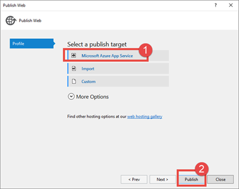

  In the new window, you will see the list of empty webapps that we created with the ARM template in your Azure subscription. Select the *registration" and click OK.  
  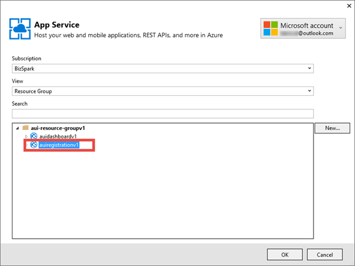

  Now in the settings window make the appropriate changes as shown in the below screenshot.  
  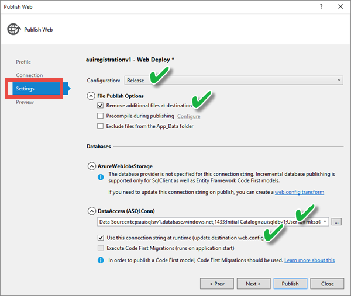

  Finally, click on the *Publish* button to publish the app on Azure.

**Dashboard Project:**  
Perform the same settings steps as the Registration web app.  

Web Apps publish parameters set to clean all existing files in the webapp folder. So if you have a previous webjob published, it will be deleted and you need to republish the web job.  

To publish the dashboard project you use the similar publish steps and select the Dashboard WebApp in the Arm template created empty WebApp project list. Also you have to enter authentication Active Directory (AD), so only the users defined under this AD will be able to access the Dashboard webpage.  
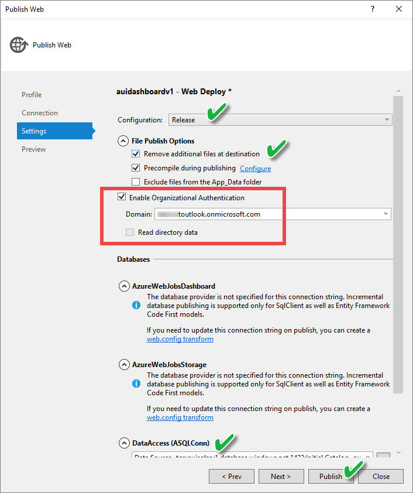

**WebJobBillingData Project:** 

Update the corresponding parameters in App.config file with the ones in the Powershell script output. This webjob project is created as a continuous webjob type. So it will always run in the background and in case there is a message in the storage queue, it will trigger a specific function in the project. So if you update the “ida:QueueBillingDataRequests” parameter in the config files, you have to update the function signature with new parameter value which has to be static coded in the function.cs file of the WebJobBillingData project as:
```
public static void ProcessQueueMessage([QueueTrigger("billingdatarequests")] BillingRequest br)
```
The **WebJobBillingData** App.config file is also where you'll specify what offer code should be used for calculating billing costs.  You can [view a list of Azure Offer Codes](https://azure.microsoft.com/en-us/support/legal/offer-details/) and then enter that code in for the "ida:OfferCode" value.  You are also able to specify the Currency, Locale, and RegionInfo here.  Important to note is that the website displays the offer number's which are most likely preceded by *MS-AZR-* so, the offer code for pay-as-you-go ends up being MS-AZR-0003P.  Also **IMPORTANT** to note is that currently, it is not possible to specify different offer code's or currency per subscription.  

To publish the WebJobBillingData webjob project, right click on the project name in the solution explorer and click on the *Publish as Azure WebJob...* menu item.  
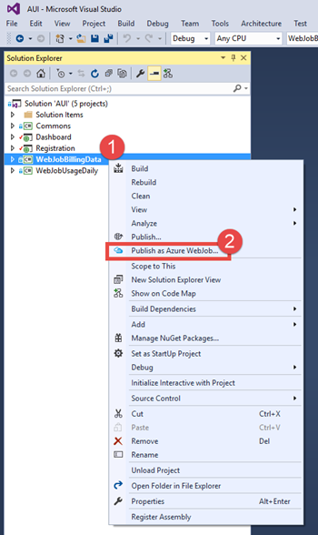

You can follow the similar steps publish the webapps above. We prefer to publish all webjobs under the Dashboard webapp as it will have enough resources to handle all workloads (it will probably have less network traffic, etc.)

**WebJobUsageDaily** Same as WebJobBillingData project parameter settings. This webjob type is scheduled. It will not run continuously and you have to set a schedule that it will only run according to the schedule (i.e. everyday night) You can set the schedule from the management portal or in the “webjob-publish-settings.json” under project properties.

Publishing this webjob on Azure will be the same as the previous webjob.

## PowerBI Report
You need to download and install the PowerBI desktop application from https://powerbi.microsoft.com/en-us/desktop. Once you have it, you can open the AUIDashboard.pbix file to modify the existing report and publish it to PowerBI online (you a need PowerBI Online account or can create 1 month trial). When you open the  AUIDashboard.pbix file, initially you will see many errors like "Fix This" as there is no data, as there is no data connection set.

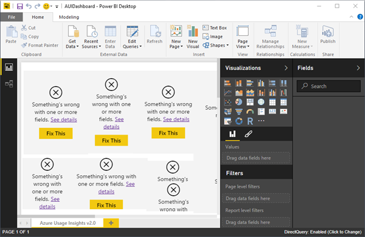 

Before publishing you need to update the SQLServer connection parameters. Once you set this connection parameters correctly, you will see something similar or a blank report as below. To make the changes, follow these instructions:  

- In the PowerBI Desktop, open the file ABIDashboard.pbix and click EditQueries button  
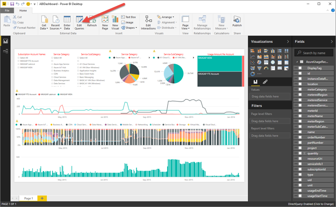  

- In the new window, click “Data Source Settings” to make required Database name, SQL Server password updates, etc.
 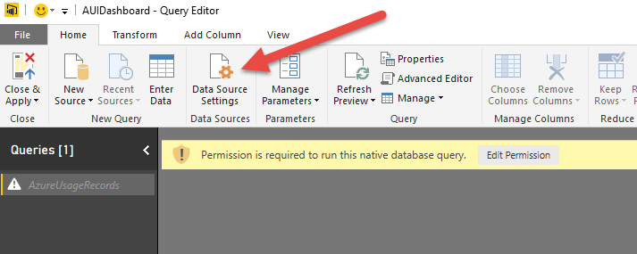  

- Click on "Change Source...", In this new window you will need to put your Server Name and Database name. You can find these in the PowerShell output inside the connectionstring ASQLConn. Once it's once it's done, click Ok.
 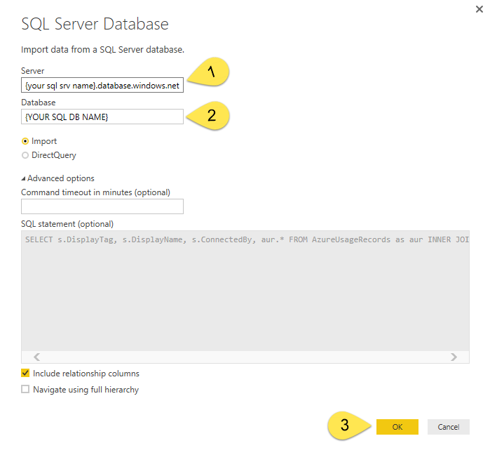 

- Next step is to set the credential. Click on "Edit Permissions", then "Edit", and "Database". Now, again from the PowerShell output copy-paste the username and password; by default it was `mksa` and `Password.1%`. Once it done, save and close to get back at Query Editor Windows.
 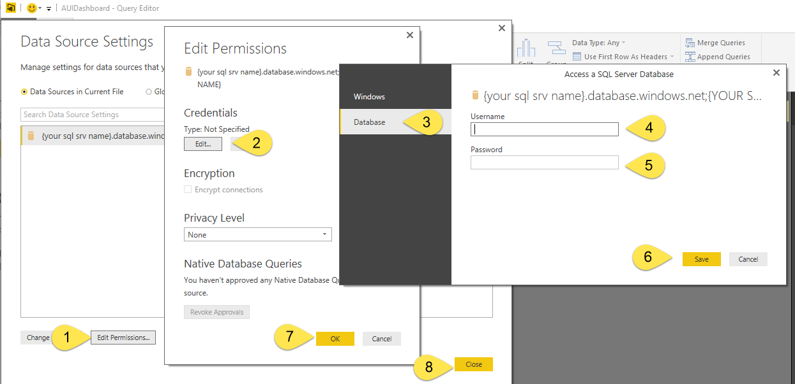 

- From the left Queries list, right-click on "AzureUsageRecords" and select "Enabled Load". Then click one the "Close & Apply" button on the top left of the window. You should see a Temporary popup "Apply Query Changes" for few seconds.
 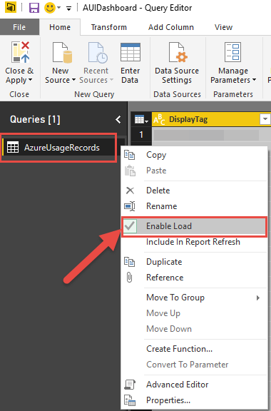 

- Now the report should show-up but still needs few fixes because 3 measures are in Error. Thankfully, it's easy to fix.
 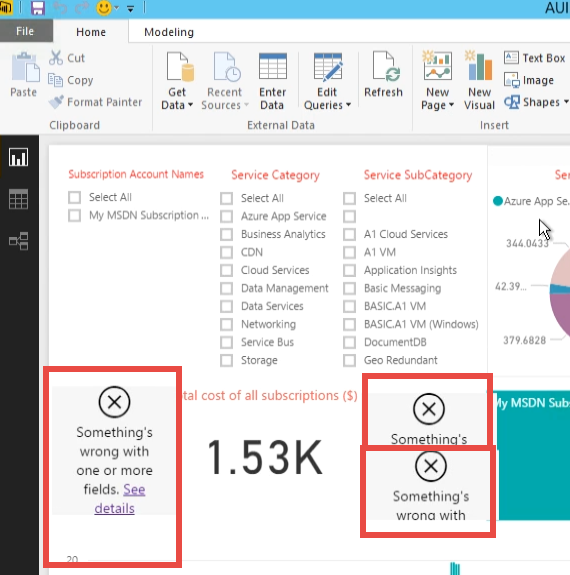 

- Select the one at the left, it's supposed to show how many subscriptions are selected. Click the button "New Measure", and type this formula:
 `NumberOfSubscriptions = DISTINCTCOUNT(AzureUsageRecords[DisplayTag])`
 Now a field should be available in the feilds list at the left called "NumberOfSubscriptions" drag & drop it into the fields property of our selected visualization like bellow.
 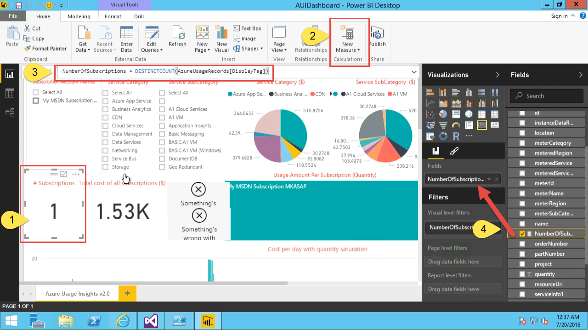 

- We need to repeat these steps for the two other errors but using those formulas:
  - `MinDate = MIN(AzureUsageRecords[usageStartTime])`
  - `MaxDate = MAX(AzureUsageRecords[usageEndTime])`

- Now you should be ready to publish. From File menu, click "Publish to Power BI" to publish it as online report that you can share with others.
 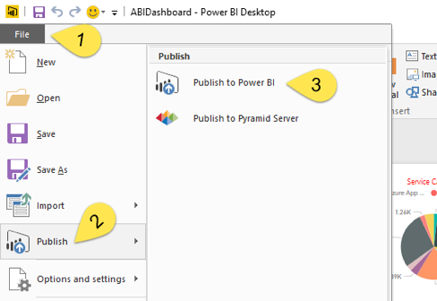  

## How to Register
Once you install and activate a running system, anyone can access the registration website and register their Azure subscription for monitoring.

- Open an internet browser with a clean session (i.e. InPrivate browsing or logout from all your prev. sessions that uses your MicrosoftIDs)  

- Go to the URL address of the Registration website to register your Azure subscription.  
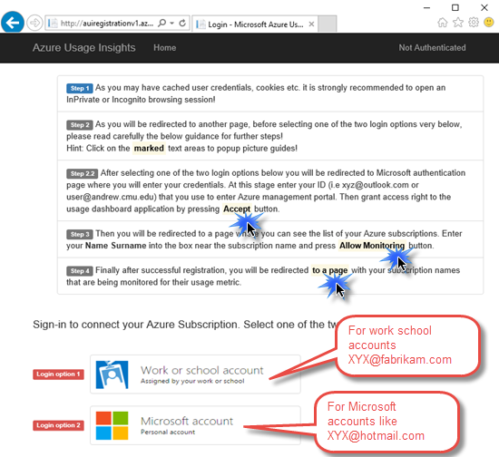  

- If you have Microsoft account (like XYZ@hotmail.com or XYZ@outlook.com etc.) that you use to login to the Azure portal, use the second login option.

- If you have work, school account (like XYZ@fabrikam.com etc.)  that you use to login to the Azure portal, use the first login.

- For option 2, enter the default Directory’s name of your Azure Subscription in to the textbox shown in step 2. If you don’t know your directory name, you should navigate to http://manage.windowsazure.com and follow the steps shown on the below image.  
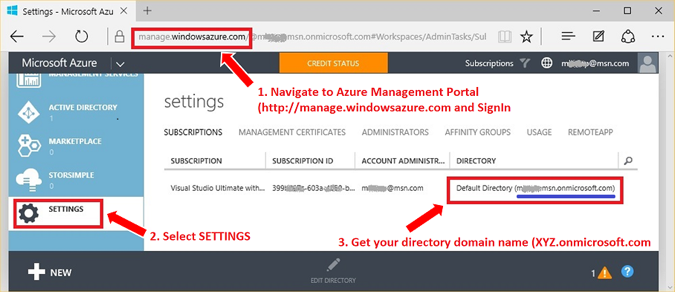  

- Your default directory name ends with “onmicrosoft.com”, i.e. it should be something like xyz.onmicrosoft.com

- Once you type the default directory’s name of your Azure Subscription in to the textbox shown in step 2 and press the “Authenticate” button, you will be redirected to the Microsoft ID authentication page to enter your Azure Subscription credentials. After entering a valid MicrosoftID and corresponding password you will be redirected to a confirmation page that asks you to grant access rights to MABD system, so it can access your directory on Azure. By clicking “accept”, so giving rights, you will generate and give a temporary access token to MABD system. Using this token, MABD system will be able to get your Azure subscriptions list (you may have more than one subscription associated with your single MicrosoftID).  
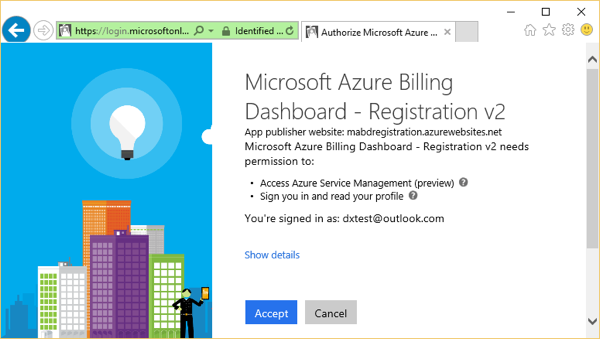  

- In the final step a list of your azure subscriptions will be shown. Each list item has a subscription name, a textbox and “Allow Monitoring” button.  In the usage reports, identifying the user by his/her 32 digit SubscritionID or email address may not be convenient. So the user is expected to enter his identifying information (i.e. first and last names) that will be shown in the reports.  
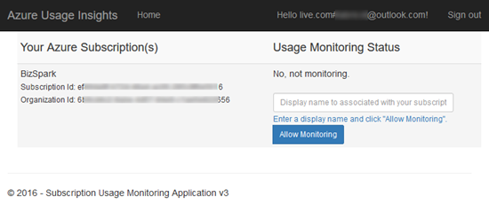  
  Once you press the “Allow monitoring” button, you will authenticate the MABD system to be able to access your usage details anytime. 

- Later, anytime you may follow the above steps 1 to 4 and cancel this permission by pressing the “Do not allow monitoring” button shown in the below image.
  

## FAQ
- Why does the PowerBI dashboard not show any data or only show partial data?
  The service tier (basic low performance one) of the SQL server is limited with connection counts, DTUs, etc. If you have too much data to visualize with PowerBI, you may be limited by this constraints. Upgrade to a higher service SQL Server service tier.

- When I delete the resource group that I created with ARM Script, will all Azure services be deleted?
  Yes, all WebApps, SQLDBs etc. under the resource group will be deleted. BUT webjobs are created under seperate "auto named" resource group when you publish the webjobs on Azure. So you need to find that Resouce group and delete it too. Otherwise Webjobs will still exist on Azure.

- How do I delete an Azure Active Directory application?
  Deleting resource group will not delete the AD App. You need to open AD App configuration page, set its "Application is multi-tenant" feature to NO. After saving new settings, the delete button will become active.


This project has adopted the [Microsoft Open Source Code of Conduct](https://opensource.microsoft.com/codeofconduct/). For more information see the [Code of Conduct FAQ](https://opensource.microsoft.com/codeofconduct/faq/) or contact [opencode@microsoft.com](mailto:opencode@microsoft.com) with any additional questions or comments.
