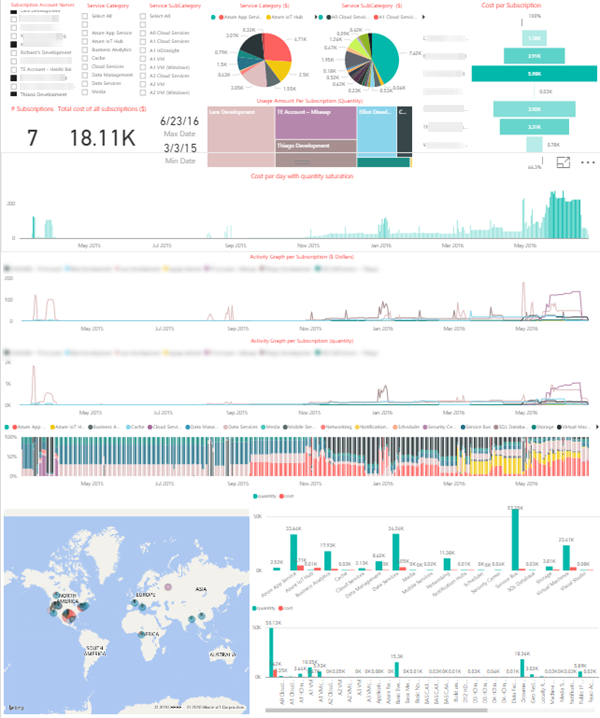

#Azure Usage and Billing Insights (AUBI) Portal

This project is designed to retrieve the usage details of all Azure services in a specific Azure subscription(s). Using PowerBI dashboard, one can retrieve up to date billing data (Azure service usage details) of a subscription that is registered to the system. 
First, any user with an active azure subscription has to register their subscription with the system through the registration website. To get registered, only the subscription owner's Microsoft ID (i.e. email address that ends with Hotmail.com, outlook.com etc.) or an organization ID (i.e. email address that ends with microsoft.com, fabrikam.com etc.) and subscription’s domain name is needed. Providing this data, a user can register their Azure subscription with the system.
Once the subscription is registered, the system automatically retrieves the past 3 years (adjustable parameter) usage data and allows it to be viewed by a PowerBI dashboard.
Additionally, every day at UTC 00:00 o’clock, the system automatically retrieves the previous day’s usage and billing data for each registered subscription in the system. By doing this, it keeps all records up to date on a daily basis. 
There is always a 1-day delay (currently you can’t retrieve the past few hours’ data immediately because the main Azure system collects all data from different datacenters within different time zones) on the data presented through PowerBI.

This system consists of the following services:
- One public **website** called Registration where any user can provide access to the site and register their Azure subscriptions.
- One **website** called Dashboard, where only authenticated users can see the list of registered subscriptions and trigger a job to re-generate up to date billing data in case of any inconsistency.
- One **AzureSQL Server** to hold billing and usage data for all registered subscriptions.
- One **Azure Storage Queue** to hold “generate data” requests.
- One schedule base (every UTC night) running **webjob** that is triggered once a day to create “generate data” request for each registered subscription.
- One continuous running **webjob** to process requests that are waiting in the Azure Storage Queue.
- **PowerBi** dashboard for data visualization of all or per subscription Azure service billing and usage details like service unit, quantity, usage duration, etc.

The PowerBI dashboard allows users to filter data in realtime according to different parameters such as: Subscriptions, Services, SubServices, etc.

##Click for [video tutorial](https://channel9.msdn.com/blogs/Mustafa-Kasap/How-to-Setup-the-Azure-Usage--Billing-Portal) on end to end Setup Instructions
##Click for [Setup Instructions](./Documentation/HOWTO.md)

Sample Report screenshot:  
  

### Enterprise Agreement Accounts

Currently due to limitations of the RateCard API, EA customers will not be able to retrieve their billing data.  This does not stop EA customers from reviewing their usage information and the PowerBI report is still quite valuable for doing this across multiple subscriptions.  The Azure Billing team has stated their plans to work on this support and you can [view the status and vote for the feature here](https://feedback.azure.com/forums/170030-signup-and-billing/suggestions/7662687-show-billing-usage-information-with-ea-subscriptio).

### Code of Conduct

This project has adopted the [Microsoft Open Source Code of Conduct](https://opensource.microsoft.com/codeofconduct/). For more information see the [Code of Conduct FAQ](https://opensource.microsoft.com/codeofconduct/faq/) or contact [opencode@microsoft.com](mailto:opencode@microsoft.com) with any additional questions or comments.
